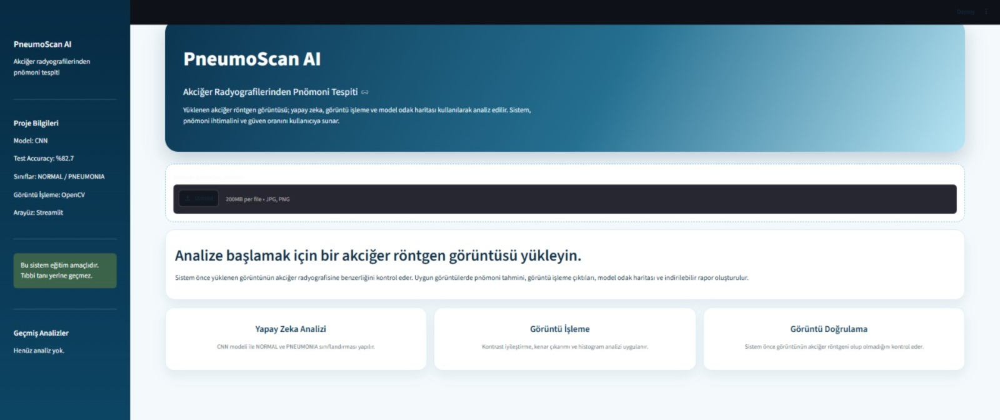
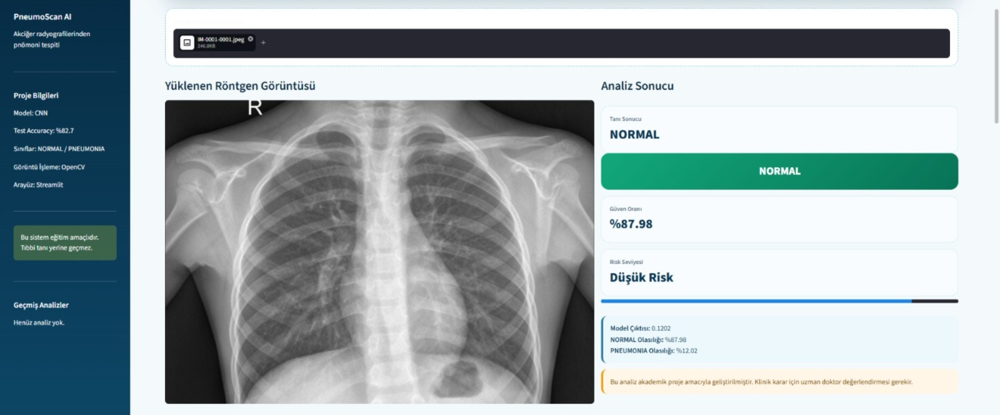
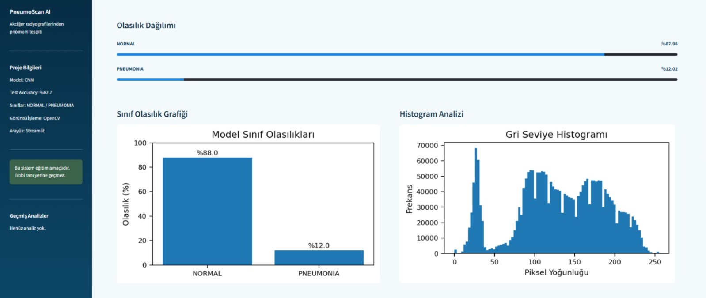
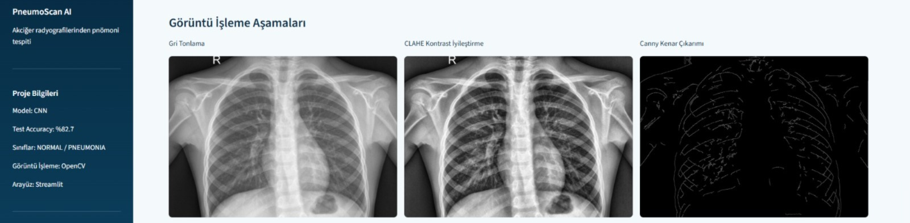
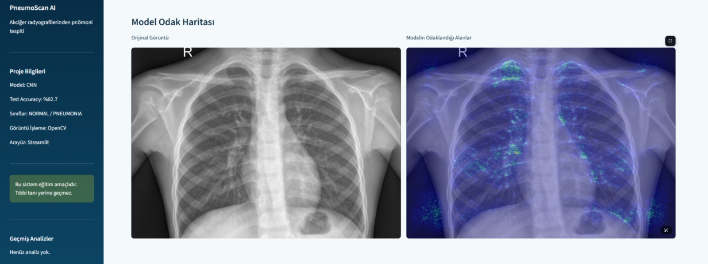
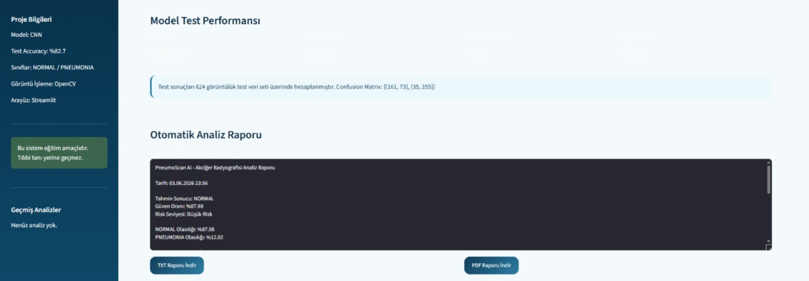

#  PneumoScan AI

Akciğer radyografileri üzerinde pnömoni tespiti gerçekleştiren yapay zeka destekli web uygulaması.

---

## 🚀 Features

- CNN tabanlı pnömoni tespiti
- Akciğer röntgeni yükleme
- Tahmin sonucu ve güven oranı gösterimi
- CLAHE kontrast iyileştirme
- Canny kenar çıkarımı
- Saliency Heatmap ile model açıklanabilirliği
- Eğitim ve test performans grafikleri
- Geçmiş analiz görüntüleme

---

## 🛠 Technologies Used

- Python
- TensorFlow / Keras
- OpenCV
- NumPy
- Matplotlib
- Scikit-Learn
- Streamlit

---

## 📊 Model Information

- Model Type: Convolutional Neural Network (CNN)
- Input Size: 224×224
- Classes:
  - NORMAL
  - PNEUMONIA
- Optimizer: Adam
- Loss Function: Binary Crossentropy
- Test Accuracy: %82.69

---

## 📂 Dataset

This project uses the Chest X-Ray Images (Pneumonia) dataset available on Kaggle:

https://www.kaggle.com/datasets/paultimothymooney/chest-xray-pneumonia

Dataset is not included in this repository due to size limitations and dataset licensing requirements.

---

## ⚙️ Installation

```bash
git clone https://github.com/rvydcftci/PneumoScan-AI.git

cd PneumoScan-AI

pip install -r requirements.txt
```

---

## ▶️ Run Application

```bash
streamlit run app.py
```

---

## 🏠 Home Screen



---

## 📤 Image Upload & Analysis



---

## 🧠 Prediction Result



---

## 🎨 CLAHE & Edge Detection



---

## 🔥 Saliency Heatmap



---

## 📊 Model Performance



---

## 📈 Performance Metrics

- Accuracy
- Precision
- Recall
- F1-Score

The developed CNN model achieved a test accuracy of 82.69% on the Chest X-Ray Pneumonia dataset.

---

## 👩‍💻 Developer

**Rüveyda Çiftci**

Fırat University  
Software Engineering

2026
